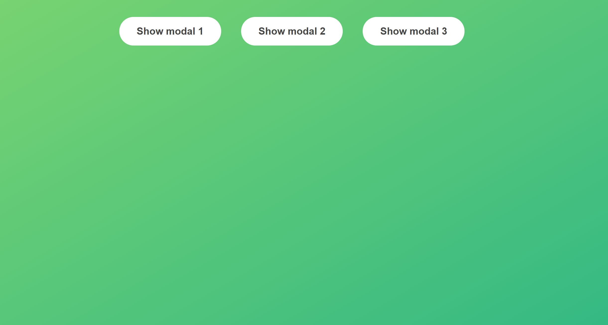
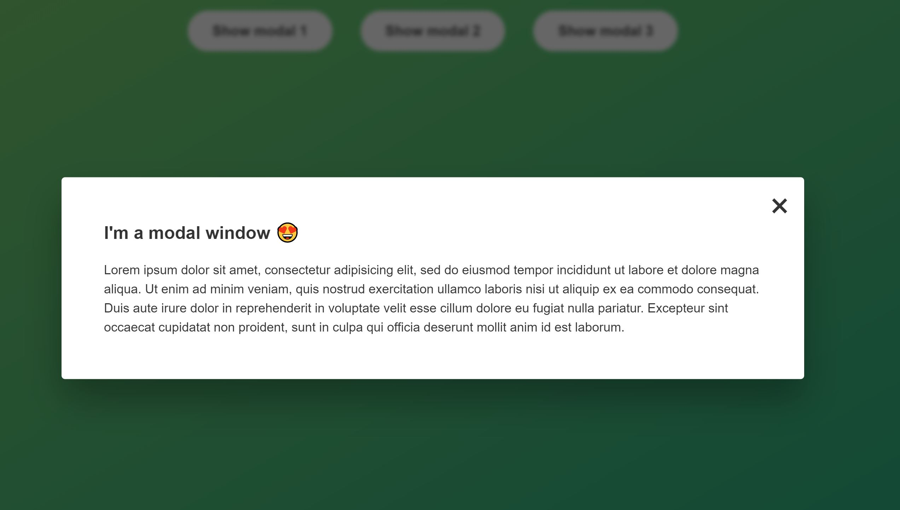

# Modal

Practicing JavaScript while taking the course "The Complete JavaScript Course: From Zero to Expert" (https://www.udemy.com/share/101WeY3@k-6lu8fMGfb2XAyn-DbsKXCKeaxDUUdXCv-VVfGaCSZYAVODIN2dvoXc4gYapbMA-Q==/).

## Overview

The code is about clicking a button, a box will appear with some content. While the box is visible, the background is a bit dark.
The window is hidden again when clicking on the background, the x button or just the Escape key.

## Technologies Used

- DOM manipulation
- if statement
- Functions
- for loop

## Links

- **Solution URL:** https://github.com/J-B-R-93/JavaScript-Modal.git

- **Live Site URL:** https://j-b-r-93.github.io/JavaScript-Modal/

## Screenshot

